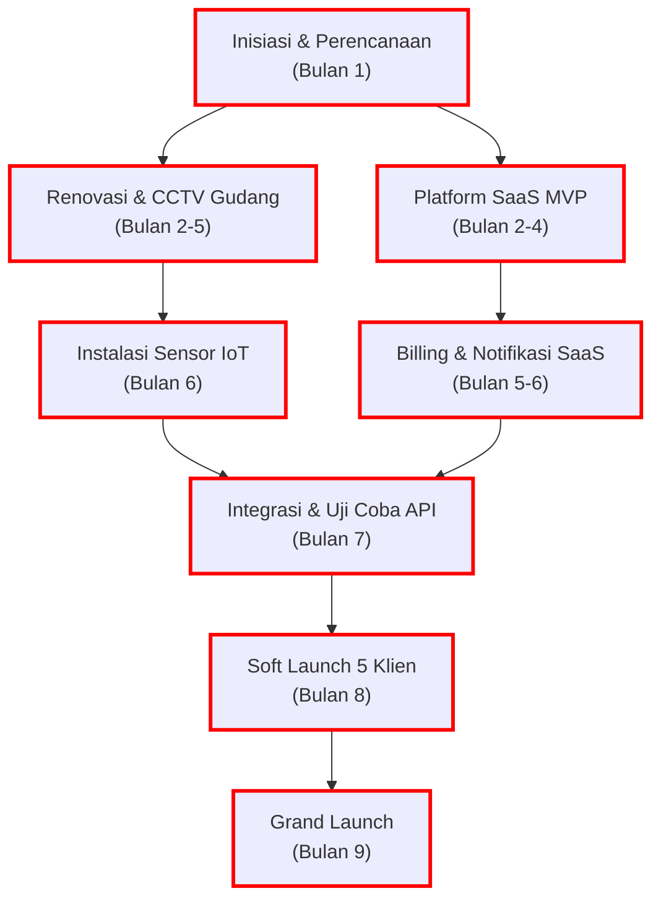
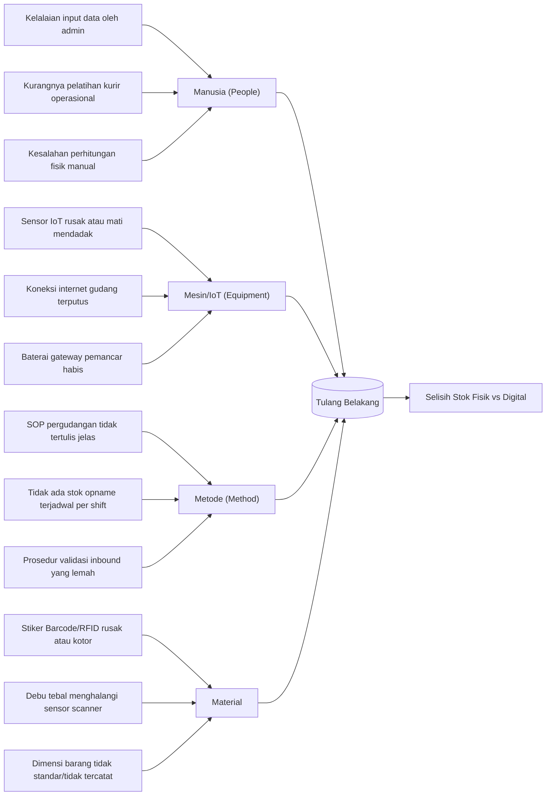

# Dokumen Perencanaan Manajemen Proyek: FlowSpace Warehouse

Dokumen ini disusun sebagai bagian dari pemenuhan tugas mata kuliah Information System Project Management (ISPM). Dokumen ini mengintegrasikan teori manajemen proyek dengan deliverables praktis untuk proyek pengembangan FlowSpace Warehouse.

---

## BAB 1: PENGANTAR MANAJEMEN PROYEK & SCRUM

### 1.1 Metodologi Pengelolaan Proyek (Pendekatan Hibrida)
FlowSpace Warehouse menggabungkan infrastruktur fisik (gudang dan instalasi perangkat keras IoT) dengan platform digital (layanan SaaS). Oleh karena itu, proyek ini dikelola menggunakan **pendekatan hibrida (Hybrid Project Management)**:

1.  **Pendekatan Prediktif (Waterfall/PMBOK):** 
    Diterapkan pada pilar konstruksi fisik, renovasi gudang, instalasi listrik, serta pemasangan sensor IoT. Fase ini membutuhkan perencanaan matang di awal karena perubahan desain fisik atau lokasi gudang di tengah jalan akan menimbulkan biaya yang sangat besar dan keterlambatan izin operasional.
2.  **Pendekatan Adaptif (Agile/Scrum):**
    Diterapkan pada pengembangan platform SaaS, dashboard monitoring, sistem billing, dan integrasi API. Kebutuhan antarmuka pengguna (UI/UX) dan fitur pelaporan bersifat dinamis. Pengembangan dibagi ke dalam siklus **Sprint selama 2 minggu** agar tim dapat merespons umpan balik pengguna dengan cepat dan merilis fitur secara bertahap dalam bentuk Minimum Viable Product (MVP).

### 1.2 Struktur Tim Scrum
Untuk pengembangan platform digital, tim diatur dengan peran berikut:
*   **Product Owner:** Menentukan prioritas fitur, menyusun backlog, dan memastikan platform SaaS menjawab kebutuhan UKM serta klien korporasi.
*   **Scrum Master:** Memfasilitasi jalannya sprint, menghilangkan hambatan teknis tim pengembang, dan menjaga agar proses Scrum tetap diikuti.
*   **Development Team (SaaS & IoT):** Terdiri dari engineer software (backend/frontend) dan engineer IoT yang bertanggung jawab mengubah backlog menjadi produk yang berfungsi di setiap akhir sprint.

### 1.3 Output 1: Product Backlog (PB)
Backlog berikut merupakan rincian dari draf awal yang telah dilengkapi dengan *Acceptance Criteria* (Kriteria Penerimaan) serta pembagian Sprint Target (dengan estimasi 1 Sprint berlangsung selama 2 minggu):

| ID | Epic | User Story | Task | Priority | Story Point | Acceptance Criteria (Kriteria Penerimaan) | Sprint Target |
| :--- | :--- | :--- | :--- | :--- | :--- | :--- | :--- |
| **PB01** | Customer Account | Sebagai customer, saya ingin mendaftar akun agar bisa menggunakan layanan warehouse | Membuat form registrasi + validasi data + simpan ke database | High | 5 | - Form registrasi meminta nama, email, nomor telepon, nama bisnis, dan password.<br>- Email harus divalidasi formatnya dan nomor telepon minimal 10 digit.<br>- Data berhasil disimpan ke database dan mengirimkan email konfirmasi akun. | Sprint 1 |
| **PB02** | Customer Account | Sebagai user, saya ingin login agar dapat mengakses dashboard | Implementasi autentikasi login + JWT/session | High | 5 | - User dapat masuk menggunakan kombinasi email dan password yang valid.<br>- Sistem mengembalikan token JWT untuk autentikasi API berikutnya.<br>- Menampilkan pesan error jika login gagal. | Sprint 1 |
| **PB03** | Warehouse Management | Sebagai admin, saya ingin menambahkan data gudang agar sistem dapat mengelola lokasi penyimpanan | CRUD data warehouse | High | 8 | - Admin dapat menambah, melihat, memperbarui, dan menonaktifkan data gudang (nama gudang, alamat, zona penyimpanan).<br>- Data terupdate seketika di database utama. | Sprint 1 |
| **PB04** | Warehouse Management | Sebagai admin, saya ingin melihat kapasitas gudang agar bisa memonitor ketersediaan ruang | Logic perhitungan kapasitas + dashboard monitoring | Medium | 5 | - Menampilkan persentase ketersediaan ruang (meter kubik) di dashboard admin.<br>- Sistem otomatis memperbarui kapasitas ketika ada barang masuk atau keluar. | Sprint 2 |
| **PB05** | Product Management | Sebagai customer, saya ingin menambahkan produk yang akan disimpan agar stok tercatat | Form input produk + simpan ke database | High | 8 | - Customer dapat memasukkan detail produk (nama, SKU, kategori, dimensi, berat, persyaratan suhu).<br>- Menghasilkan barcode/QR Code unik untuk setiap produk baru. | Sprint 2 |
| **PB06** | Product Management | Sebagai admin, saya ingin melihat daftar produk dalam gudang agar mudah dikontrol | API list produk + tampilan tabel produk | High | 5 | - Terdapat tabel daftar produk yang menampilkan SKU, nama produk, jumlah stok, zona simpan, dan status sensor IoT (jika ada).<br>- Menyediakan fitur pencarian berdasarkan SKU atau nama produk. | Sprint 2 |
| **PB07** | Pickup Service | Sebagai customer, saya ingin request pickup agar barang dijemput ke lokasi saya | Form request pickup + simpan order | High | 8 | - Form request pickup meminta alamat penjemputan, tanggal penjemputan, dan daftar produk yang akan dijemput.<br>- Status request diubah menjadi "Pending Approval" setelah form dikirim. | Sprint 3 |
| **PB08** | Pickup Service | Sebagai admin, saya ingin assign kurir untuk pickup agar barang bisa dijemput | Fitur assign kurir + update status | High | 5 | - Admin dapat memilih kurir yang bertugas untuk setiap request penjemputan yang disetujui.<br>- Notifikasi tugas penjemputan dikirim ke kurir terkait. | Sprint 3 |
| **PB09** | Delivery Service | Sebagai customer, saya ingin request delivery agar barang dikirim ke tujuan | Form request delivery + generate order | High | 8 | - Customer dapat membuat permintaan pengiriman barang dari gudang ke alamat tujuan pihak ketiga.<br>- Sistem memotong kuota kapasitas/stok sementara (di-reserve) untuk menghindari double booking. | Sprint 4 |
| **PB10** | Delivery Service | Sebagai kurir, saya ingin update status pengiriman agar customer bisa tracking | Update status (On Delivery, Delivered) | High | 5 | - Kurir dapat mengubah status melalui aplikasi mobile saat barang dibawa ("Dalam Perjalanan") dan saat diterima ("Terkirim").<br>- Sistem mencatat timestamp saat status berubah. | Sprint 4 |
| **PB11** | Tracking System | Sebagai customer, saya ingin melihat status barang agar tahu posisi produk | Halaman tracking + API status | High | 8 | - Halaman tracking menampilkan timeline pergerakan produk (registrasi gudang, pickup, di gudang, pengiriman, terkirim).<br>- Pelacakan dapat diakses menggunakan nomor resi/order penjemputan atau pengiriman. | Sprint 5 |
| **PB12** | Billing | Sebagai admin, saya ingin sistem menghitung biaya penyimpanan otomatis agar invoice akurat | Logic perhitungan biaya per hari/bulan | Medium | 8 | - Sistem menghitung biaya sewa berdasarkan volume barang (m³) dikalikan tarif per hari.<br>- Menghitung biaya tambahan seperti penanganan masuk/keluar (inbound/outbound fee). | Sprint 5 |
| **PB13** | Billing | Sebagai customer, saya ingin melihat invoice agar tahu total pembayaran | Generate invoice + tampilan invoice | Medium | 5 | - Tagihan otomatis terbit pada tanggal 1 setiap bulan.<br>- Menyediakan file PDF invoice yang dapat diunduh oleh customer. | Sprint 6 |
| **PB14** | Notification | Sebagai customer, saya ingin mendapat notifikasi saat status berubah agar selalu update | Integrasi notifikasi email/WA | Medium | 8 | - Notifikasi dikirim ketika barang berhasil inbound, ketika ada perubahan suhu di luar batas (alert sensor IoT), dan saat barang outbound. | Sprint 6 |
| **PB15** | Reporting | Sebagai admin, saya ingin melihat laporan aktivitas warehouse agar bisa evaluasi kinerja | Dashboard laporan + export PDF/Excel | Low | 13 | - Admin dapat melihat grafik pergerakan barang bulanan, utilitas kapasitas total gudang, dan ringkasan transaksi.<br>- Laporan dapat diekspor ke format Excel dan PDF. | Sprint 7 |

---

## BAB 2: MANAJEMEN INTEGRASI PROYEK (PROJECT INTEGRATION MANAGEMENT)

### 2.1 Konsep Integrasi Sistem
Manajemen Integrasi dalam proyek FlowSpace bertujuan untuk menyelaraskan seluruh elemen proyek agar bekerja harmonis. Tantangan utama terletak pada penyatuan aspek fisik dan digital:
1.  **Integrasi Hardware ke Platform Cloud:** Menghubungkan sensor suhu dan sensor inframerah/RFID pembaca barang di gudang dengan API platform SaaS di cloud secara real-time melalui protokol MQTT/HTTPS.
2.  **Koordinasi Konstruksi dan Rilis Software:** Memastikan jadwal perbaikan fisik gudang dan sertifikasi kelayakan logistik selesai tepat waktu agar pengujian software menggunakan hardware fisik (sensor IoT di lokasi) dapat berjalan sesuai jadwal uji coba (soft launch).
3.  **Prosedur Pengendalian Perubahan (Change Control):** Setiap perubahan pada lingkup fisik (misalnya perubahan tata letak rak gudang) atau kode software wajib melalui persetujuan tertulis dari Project Sponsor dan Project Manager melalui formulir Change Request resmi.

### 2.2 Output 2: Business Case (BC)

#### 1. Ringkasan Eksekutif
FlowSpace Warehouse menawarkan solusi pergudangan pintar hibrida pertama di Jabodetabek yang ditujukan untuk UKM e-commerce dan perusahaan distribusi menengah. Layanan kami menggabungkan penyewaan gudang fisik fleksibel (sesuai volume penggunaan) dengan platform pemantauan stok berbasis Software-as-a-Service (SaaS) yang terintegrasi sensor IoT. Melalui platform ini, pelanggan dapat memantau pergerakan barang, kapasitas sisa, dan kondisi lingkungan gudang (seperti suhu) secara real-time tanpa perlu datang ke lokasi.

#### 2. Analisis Masalah & Peluang Pasar
*   **Masalah UKM:** Gudang tradisional menuntut kontrak jangka panjang yang tidak fleksibel serta investasi besar. UKM sering terpaksa menyimpan barang di rumah atau ruko dengan keamanan terbatas dan sistem pencatatan manual yang rentan selisih.
*   **Masalah Perusahaan Menengah & Besar:** Kesulitan mengontrol kondisi stok fisik di beberapa lokasi gudang pihak ketiga, suhu penyimpanan yang tidak konsisten untuk produk sensitif, serta keterlambatan sinkronisasi data stok fisik dengan sistem ERP pusat.
*   **Peluang Pasar:** Pertumbuhan pesat industri e-commerce di Indonesia memicu lonjakan permintaan ruang penyimpanan mikro dan menengah yang transparan, aman, dan fleksibel. Layanan pergudangan pintar berbasis IoT merupakan solusi yang belum banyak dieksplorasi dengan harga terjangkau.

#### 3. Deskripsi Solusi & Model Bisnis
*   **Solusi:** Menyediakan ruang penyimpanan fisik modular yang dilengkapi sensor IoT (suhu dan RFID) untuk otomatisasi pencatatan stok, terhubung langsung ke dashboard aplikasi web dan mobile.
*   **Model Bisnis:** 
    1.  *Subscription SaaS:* Biaya langganan bulanan platform digital untuk akses fitur analisis tingkat lanjut dan integrasi API ERP (mulai dari Rp 250.000/bulan).
    2.  *Pay-as-you-use Warehouse:* Biaya sewa ruang fisik yang dihitung per meter kubik (m³) per bulan (misal Rp 150.000/m³/bulan).

#### 4. Analisis Kompetitif
Dibandingkan dengan gudang sewa konvensional (kontrak tahunan, data manual) atau layanan pemenuhan pesanan (3PL fulfillment biasa), FlowSpace unggul dalam hal fleksibilitas kapasitas, kontrol lingkungan berbasis sensor (IoT), transparansi dashboard real-time, serta kemampuan integrasi langsung dengan sistem ERP klien korporasi.

#### 5. Proyeksi Keuangan 3 Tahun
Investasi awal yang direncanakan adalah sebesar **Rp 3.000.000.000** (Tiga Miliar Rupiah).

```
| Indikator Keuangan | Tahun 1 | Tahun 2 | Tahun 3 |
| :--- | :--- | :--- | :--- |
| Tingkat Keterisian Gudang | 50% - 70% | 80% - 85% | 90% (Ekspansi Lokasi 2) |
| Total Pendapatan | Rp 1.500.000.000 | Rp 3.200.000.000 | Rp 5.500.000.000 |
| Biaya Operasional (Opex) | Rp 1.200.000.000 | Rp 2.000.000.000 | Rp 3.000.000.000 |
| Laba Bersih | Rp 300.000.000 | Rp 1.200.000.000 | Rp 2.500.000.000 |
```

*   **Payback Period (Waktu Pengembalian Modal):** Estimasi titik impas tercapai dalam waktu **2,2 tahun** sejak operasional dimulai, didorong oleh efisiensi ruang gudang dan margin tinggi dari layanan SaaS.

#### 6. Strategi Go-To-Market (GTM)
*   **UKM:** Pemasaran melalui komunitas penjual online (seller marketplace), iklan digital tertarget, dan pemberian promosi gratis biaya langganan platform SaaS selama 30 hari pertama bagi penyewa gudang baru.
*   **Korporasi:** Pendekatan penjualan langsung B2B (direct sales) dengan presentasi kelayakan sistem dan penawaran kustomisasi API untuk diintegrasikan dengan ERP korporat (seperti SAP atau Odoo).

#### 7. Analisis Risiko Bisnis
*   **Risiko Tingkat Keterisian Rendah:** Gudang fisik memiliki biaya sewa tetap yang tinggi. *Mitigasi:* Menggunakan skema kerja sama bagi hasil dengan pemilik properti di awal proyek untuk mengurangi beban sewa tetap.
*   **Risiko Kegagalan Perangkat IoT:** Sensor yang rusak dapat menghentikan otomatisasi pencatatan. *Mitigasi:* Menyediakan perangkat cadangan (spare units) di lokasi gudang dan melakukan pemeliharaan preventif mingguan.

#### 8. Pendanaan & Penggunaan Dana
Total kebutuhan dana sebesar **Rp 3.000.000.000** akan dialokasikan sebagai berikut:
1.  **Fasilitas Fisik (50% / Rp 1.500.000.000):** Penyewaan gudang Jabodetabek tahun pertama, renovasi sekat modular, pemasangan CCTV, kelistrikan, dan pembelian serta instalasi modul sensor IoT.
2.  **Pengembangan Platform SaaS (30% / Rp 900.000.000):** Gaji tim developer (backend, frontend, DevOps) selama 9 bulan fase proyek dan biaya sewa server cloud.
3.  **Operasional & Pemasaran (20% / Rp 600.000.000):** Biaya pemasaran awal, gaji staf gudang, izin legalitas, dan dana cadangan operasional darurat.

### 2.3 Rencana Pengelolaan Proyek (Project Management Plan)
Rencana Pengelolaan Proyek ini berfungsi sebagai dokumen induk yang mengintegrasikan seluruh rencana fungsional anak (*subsidiary plans*) guna memastikan seluruh aspek proyek terpantau dengan jelas:

1.  **Integrasi Rencana Anak:**
    *   *Rencana Pengelolaan Lingkup (Scope):* Menentukan batasan pekerjaan fisik dan digital berdasarkan WBS di Bab 4.
    *   *Rencana Pengelolaan Jadwal (Schedule):* Mengontrol timeline 9 bulan menggunakan Gantt Chart dan memantau dependensi melalui Critical Path Analysis di Bab 5.
    *   *Rencana Pengelolaan Biaya (Cost):* Memastikan pengeluaran tetap berada di dalam budget baseline Rp 3.000.000.000 yang dirinci di Bab 5.
    *   *Rencana Pengelolaan Kualitas (Quality):* Menjaga kepatuhan standar software dan hardware melalui prosedur QA/QC di Bab 6.
    *   *Rencana Pengelolaan Risiko (Risk):* Mengidentifikasi dan menyiapkan mitigasi atas 6 risiko utama menggunakan Risk Register di Bab 7.
2.  **Mekanisme Koordinasi Tim:**
    *   *Rapat Integrasi Mingguan (Weekly Integration Meeting):* Dipimpin oleh Project Manager, dihadiri oleh Tech Lead (Rian Wijaya) dan Facility Manager (Siti Aminah) untuk menyelaraskan kemajuan pekerjaan fisik gudang dengan rilis sprint platform SaaS.
    *   *Rapat Tinjauan Proyek Bulanan (Monthly Project Review):* Pertemuan formal dengan Project Sponsor (Budi Santoso) untuk melaporkan kinerja biaya dan jadwal menggunakan analisis Earned Value Management (EVM).
3.  **Alur Otorisasi dan Kontrol Perubahan:**
    *   Setiap perubahan pada rencana dasar (*baselines*) wajib melalui persetujuan tertulis dari Project Sponsor setelah dianalisis dampak integrasinya (biaya, jadwal, risiko) oleh Project Manager.

---

## BAB 3: MANAJEMEN RUANG LINGKUP PROYEK (PROJECT SCOPE MANAGEMENT)

### 3.1 Pendefinisian dan Pengendalian Ruang Lingkup
Manajemen Ruang Lingkup memastikan proyek hanya mengerjakan aktivitas yang diperlukan untuk mencapai tujuan akhir, serta menghindari *scope creep* (pelebaran lingkup tanpa kendali):
*   **Proses Pengumpulan Kebutuhan:** Tim mengumpulkan kebutuhan pengguna dari perwakilan UKM (Andi) dan korporasi (Siska) melalui wawancara dan kuisioner. Hasilnya adalah daftar kebutuhan fungsional seperti sinkronisasi stok otomatis dan pemesanan kapasitas fleksibel.
*   **Pernyataan Ruang Lingkup (Scope Statement):** Batasan proyek didefinisikan secara tegas. Kegiatan logistik pengiriman akhir (*last-mile delivery*) dan proses manufaktur internal milik klien secara resmi berada di luar lingkup proyek (*out of scope*).
*   **Verifikasi dan Kontrol Scope:** Setiap akhir tahapan, dilakukan demonstrasi fungsionalitas (seperti demo dashboard SaaS atau uji coba sensor fisik). Jika terdapat permintaan fitur tambahan di luar rencana awal, permintaan tersebut harus diajukan melalui sistem *Change Control Board* (CCB) untuk dianalisis dampak biaya dan jadwalnya sebelum disetujui.

### 3.2 Output 3: Project Charter (PC)

#### 1. Latar Belakang & Deskripsi Proyek
FlowSpace Warehouse dirancang untuk menjadi jawaban atas kendala logistik pergudangan di wilayah Jabodetabek. Banyak UKM e-commerce kesulitan menemukan ruang penyimpanan yang fleksibel dari segi volume dan durasi sewa, sementara perusahaan besar sering mengalami kesalahan pencatatan akibat stok fisik gudang dan data digital yang tidak sinkron. Proyek ini menyatukan infrastruktur gudang fisik, sensor IoT (suhu dan RFID), dan platform digital SaaS untuk otomatisasi pelacakan persediaan secara real-time.

#### 2. Tujuan Proyek & Kriteria Keberhasilan (SMART)
*   **Akurasi Data Stok:** Menjaga agar selisih antara jumlah stok fisik di gudang dengan catatan digital di dashboard SaaS tidak melebihi **0,1%** sejak bulan pertama peluncuran penuh.
*   **Tingkat Keterisian Gudang:** Mencapai minimal **70%** keterisian kapasitas fisik gudang pada akhir tahun pertama operasional.
*   **Retensi Pengguna Platform:** Menjaga agar minimal **85%** pelanggan SaaS tetap aktif berlangganan pada bulan ke-12 sejak terdaftar.

#### 3. Struktur Organisasi & Otoritas Tim
*   **Project Sponsor:** Budi Santoso (Direktur Utama)
    *   *Tanggung Jawab:* Menyetujui anggaran proyek, mencairkan dana, dan mengambil keputusan terkait perubahan strategi atau arah bisnis utama.
*   **Project Manager:** Kelompok 8 ISPM
    *   *Tanggung Jawab:* Memimpin koordinasi harian tim software dan fisik, mengontrol anggaran, serta memastikan jadwal proyek selesai tepat waktu.
    *   *Otoritas:* Berwenang mengambil tindakan korektif jika terjadi variasi anggaran kurang dari 10% atau keterlambatan jadwal di bawah 2 minggu tanpa persetujuan Sponsor.
*   **Tech Lead:** Rian Wijaya
    *   *Tanggung Jawab:* Memimpin pengembangan platform SaaS, arsitektur database cloud, dan integrasi API sensor IoT.
*   **Facility Manager:** Siti Aminah
    *   *Tanggung Jawab:* Mengawasi operasional renovasi fisik gudang, pemasangan sistem keamanan fisik (biometrik/CCTV), serta instalasi hardware sensor IoT.

#### 4. Asumsi dan Batasan Proyek
*   *Asumsi:* Perangkat keras sensor IoT (suhu dan RFID) dapat diimpor dan dipasang dalam waktu maksimal 4 minggu tanpa kendala rantai pasok global.
*   *Batasan:* Proyek ini hanya mencakup penyediaan ruang penyimpanan dan pemantauan sistem. Pengantaran barang dari pintu gudang ke alamat pembeli akhir dikelola langsung oleh pihak logistik ketiga (3PL) eksternal pilihan klien.

---

## BAB 4: MANAJEMEN WAKTU PROYEK (PROJECT SCHEDULE MANAGEMENT)

### 4.1 Definisi Aktivitas dan Estimasi Durasi
Manajemen Waktu berfokus pada penjadwalan aktivitas proyek secara logis agar proyek selesai dalam jangka waktu 9 bulan yang telah ditetapkan:
*   **Definisi Aktivitas:** Setiap elemen pekerjaan utama dipecah menjadi tugas-tugas terukur (Work Packages). Misalnya, instalasi IoT dipecah menjadi perakitan sirkuit, kalibrasi sensor, pengujian sinyal, dan pemasangan fisik di rak gudang.
*   **Estimasi Durasi:** Durasi pengerjaan platform SaaS diestimasi menggunakan unit *Story Points* melalui sesi perencanaan tim pengembang. Sedangkan untuk pekerjaan renovasi fisik gudang dan instalasi listrik, durasi dihitung menggunakan satuan hari kerja berdasarkan estimasi dari vendor kontraktor.

### 4.2 Output 4: Work Breakdown Structure (WBS)
Berikut adalah visualisasi Work Breakdown Structure untuk proyek FlowSpace Warehouse yang membagi pekerjaan ke dalam fase-fase utama tanpa menjabarkannya ke sub-task terkecil yang tidak perlu:

```mermaid
graph TD
    WBS["1. Proyek FlowSpace Warehouse"]
    
    %% Level 2
    WBS --> F1["1.1 Inisiasi Proyek"]
    WBS --> F2["1.2 Perencanaan & Desain"]
    WBS --> F3["1.3 Renovasi Gudang & IoT (Fisik)"]
    WBS --> F4["1.4 Pengembangan Platform SaaS (Digital)"]
    WBS --> F5["1.5 Integrasi & Pengujian"]
    WBS --> F6["1.6 Peluncuran & Penutupan"]
    
    %% Level 3 - Inisiasi
    F1 --> F11["1.1.1 Penyusunan Project Charter"]
    F1 --> F12["1.1.2 Kick-off Meeting Stakeholder"]
    
    %% Level 3 - Perencanaan
    F2 --> F21["1.2.1 Analisis Kebutuhan Sistem"]
    F2 --> F22["1.2.2 Desain Wireframe & Arsitektur Cloud"]
    F2 --> F23["1.2.3 Desain Tata Letak Rak & Alur Kerja Gudang"]
    
    %% Level 3 - Fisik
    F3 --> F31["1.3.1 Sewa Lokasi Gudang (Jabodetabek)"]
    F3 --> F32["1.3.2 Renovasi Sekat Modular & Sistem Listrik"]
    F3 --> F33["1.3.3 Pemasangan CCTV & Kontrol Biometrik"]
    F3 --> F34["1.3.4 Instalasi & Kalibrasi Sensor IoT"]
    
    %% Level 3 - Digital
    F4 --> F41["1.4.1 Pembuatan Form Registrasi & Autentikasi JWT"]
    F4 --> F42["1.4.2 Dashboard Kapasitas & API CRUD Gudang"]
    F4 --> F43["1.4.3 Fitur Pickup, Delivery, & Pelacakan Barang"]
    F4 --> F44["1.4.4 Sistem Billing Otomatis & Fitur Notifikasi"]
    
    %% Level 3 - Integrasi
    F5 --> F51["1.5.1 Integrasi API Sensor IoT ke Database SaaS"]
    F5 --> F52["1.5.2 Uji Coba Keamanan Sistem & Enkripsi Data"]
    F5 --> F53["1.5.3 Uji Coba End-to-End dengan 5 Klien Awal"]
    
    %% Level 3 - Peluncuran
    F6 --> F61["1.6.1 Peluncuran Publik (Grand Launching)"]
    F6 --> F62["1.6.2 Serah Terima Aset & Laporan Penutupan Proyek"]

---

## BAB 5: MANAJEMEN BIAYA PROYEK (PROJECT COST MANAGEMENT)

### 5.1 Estimasi Biaya dan Pengendalian Keuangan
Manajemen Biaya memastikan proyek diselesaikan dalam batasan anggaran yang telah disetujui melalui beberapa proses kontrol:
*   **Estimasi Biaya (Bottom-Up):** Setiap komponen kerja pada WBS diestimasi biayanya secara terpisah. Biaya fisik dihitung berdasarkan penawaran harga kontraktor, sedangkan biaya pengembangan platform dihitung dari jumlah engineer yang dibutuhkan dikalikan dengan durasi bulan pengerjaan.
*   **Pengendalian Biaya dengan Earned Value Management (EVM):** Selama proyek berjalan, tim menggunakan metrik EVM seperti *Schedule Variance* (SV) dan *Cost Variance* (CV) setiap akhir bulan. Jika SV bernilai negatif, artinya pengerjaan terlambat dari jadwal, dan jika CV bernilai negatif, artinya pengeluaran melebihi anggaran rencana (*overbudget*). Hal ini memungkinkan tindakan koreksi cepat sebelum anggaran terserap habis.

### 5.2 Output 5: Project Schedule & Budget Baseline

#### 1. Gantt Chart Proyek (Bulan 1 - Bulan 9)
Diagram Gantt berikut memvisualisasikan garis waktu pengerjaan proyek FlowSpace Warehouse dari tahap inisiasi hingga peluncuran penuh:

```mermaid
gantt
    title Jadwal Pelaksanaan Proyek FlowSpace Warehouse (9 Bulan)
    dateFormat  YYYY-MM-DD
    axisFormat %m / %y
    
    section Inisiasi & Perencanaan
    Project Charter & Kick-off :active, a1, 2026-06-01, 2026-06-30
    
    section Renovasi & IoT Fisik
    Sewa Gudang & Tata Letak : b1, 2026-07-01, 2026-07-31
    Renovasi & CCTV Gudang   : b2, 2026-08-01, 2026-10-31
    Instalasi Sensor IoT     : b3, 2026-11-01, 2026-11-30
    
    section Pengembangan SaaS
    Pengembangan Platform MVP : c1, 2026-07-01, 2026-09-30
    Billing & Notifikasi      : c2, 2026-10-01, 2026-11-30
    
    section Integrasi & Uji Coba
    Integrasi API & Uji Coba  : d1, 2026-12-01, 2026-12-31
    
    section Peluncuran
    Soft Launch dengan 5 Klien : e1, 2027-01-01, 2027-01-31
    Peluncuran Penuh (Grand Launch) : e2, 2027-02-01, 2027-02-28
```

#### 2. Diagram Critical Path Analysis (CPA)
Jalur Kritis (*Critical Path*) adalah lintasan aktivitas dengan total durasi terpanjang yang menentukan tanggal selesai proyek tercepat. Dalam proyek hibrida ini, jalur fisik gudang (renovasi dan IoT) dan jalur digital (platform SaaS) keduanya memiliki durasi total yang sama (9 bulan) dan harus diselesaikan secara paralel agar integrasi di Bulan 7 dapat dilakukan.

Oleh karena itu, kedua jalur tersebut berada pada lintasan kritis (ditandai dengan warna merah):



#### 3. Rincian Anggaran Detail (Budget Baseline)
Anggaran proyek didasarkan pada target modal awal sebesar **Rp 3.000.000.000** (Tiga Miliar Rupiah) yang terbagi ke dalam alokasi terperinci sebagai berikut:

```
| No | Komponen Anggaran | Rincian Perhitungan | Jumlah Alokasi |
| :--- | :--- | :--- | :--- |
| 1 | Sewa Gudang Fisik | Sewa gudang di wilayah Bekasi (Jabodetabek) selama 1 tahun | Rp 400.000.000 |
| 2 | Renovasi & Keamanan | Pembagian sekat modular rak, instalasi listrik, CCTV, & biometrik | Rp 700.000.000 |
| 3 | Perangkat Keras IoT | Pembelian 150 unit sensor suhu & RFID serta gateway IoT | Rp 400.000.000 |
| 4 | Gaji Tim Developer SaaS | 4 software developer x Rp 15.000.000/bulan x 9 bulan | Rp 540.000.000 |
| 5 | Gaji Tim QA & IoT | 2 QA & hardware engineer x Rp 12.000.000/bulan x 9 bulan | Rp 216.000.000 |
| 6 | Gaji Manajemen Proyek | Project Manager & Business Analyst selama 9 bulan | Rp 244.000.000 |
| 7 | Infrastruktur Cloud | Sewa server AWS & database cloud selama 1 tahun | Rp 100.000.000 |
| 8 | Operasional Gudang | Gaji staf operasional & biaya listrik gudang tahun pertama | Rp 150.000.000 |
| 9 | Pemasaran & Peluncuran | Kampanye iklan digital, promosi UKM, & event launching | Rp 150.000.000 |
| 10| Cadangan Kontingensi | Dana cadangan risiko tak terduga (10% dari sisa alokasi) | Rp 100.000.000 |
| **-** | **Total Anggaran** | **Penjumlahan seluruh pos komponen anggaran** | **Rp 3.000.000.000** |

---

## BAB 6: MANAJEMEN KUALITAS PROYEK (PROJECT QUALITY MANAGEMENT)

### 6.1 Penjaminan Kualitas (Quality Assurance) dan Pengendalian Kualitas (Quality Control)
Manajemen Kualitas memastikan proyek menghasilkan sistem yang andal dan bekerja sesuai spesifikasi, baik pada aspek hardware maupun software:
*   **Penjaminan Kualitas (Quality Assurance):** Proses untuk memastikan standar pengerjaan diikuti sejak awal. Tim menetapkan standar penulisan kode software (*clean code*) dengan code review berkala, dan membuat prosedur kalibrasi standar pabrikan untuk semua modul sensor IoT sebelum dikirim ke gudang.
*   **Pengendalian Kualitas (Quality Control):** Aktivitas pengujian produk akhir untuk mendeteksi kecacatan. Di sisi software, tim menjalankan pengujian otomatis (*unit testing*), pengujian integrasi API, dan pengujian beban (*load testing*) untuk mensimulasikan akses dashboard oleh ribuan pengguna secara bersamaan. Di sisi hardware, tim melakukan pengujian fisik daya tahan baterai sensor dan akurasi pembacaan suhu dalam ruang berpendingin selama 72 jam terus-menerus.

### 6.2 Output 7: Cause and Effect Diagram (Ishikawa/Fishbone Diagram)
Diagram sebab-akibat berikut digunakan untuk memetakan akar penyebab masalah utama operasional gudang, yaitu **"Selisih/Ketidaksesuaian Data Stok Fisik vs Digital"**, sehingga tim proyek dapat merancang tindakan pencegahan yang tepat:



### 6.3 Rencana Pengelolaan Kualitas (Quality Management Plan)
Rencana Pengelolaan Kualitas ini disusun untuk memastikan seluruh deliverables proyek memenuhi standar keandalan tinggi yang dapat diukur secara kuantitatif:

#### 1. Standar Kualitas Kuantitatif (Quality Standards)
*   **Platform Digital (SaaS):**
    *   *Uptime Platform:* Ketersediaan sistem minimal **99,9%** per bulan, diukur menggunakan tools monitoring eksternal.
    *   *Waktu Respon (Response Time):* Kecepatan respon API tidak boleh melebihi **200 milidetik (ms)** untuk 95% total transaksi normal.
    *   *Cakupan Pengujian Kode (Code Coverage):* Minimal **80%** dari seluruh baris kode backend wajib lolos pengujian otomatis (*unit testing*).
    *   *Keamanan Data:* Enkripsi token sesi menggunakan algoritma JWT HS256, dan semua lalu lintas data wajib menggunakan protokol HTTPS/TLS 1.3.
*   **Infrastruktur Fisik & Hardware (IoT):**
    *   *Akurasi Sensor:* Toleransi penyimpangan pembacaan sensor suhu maksimal **±0,5°C** dibanding termometer kalibrasi industri.
    *   *Konektivitas Sensor:* Tingkat keberhasilan pengiriman paket data sensor dari rak gudang ke gateway minimal **99%** dalam kondisi operasional penuh.
    *   *Daya Tahan Baterai:* Sensor nirkabel wajib beroperasi minimal **12 bulan** tanpa memerlukan penggantian baterai.

#### 2. Aktivitas Penjaminan Kualitas (Quality Assurance - QA)
*   **Tinjauan Kode Berkelanjutan (Continuous Code Review):** Tech Lead memimpin review mingguan terhadap seluruh kode baru sebelum dilakukan penggabungan (*merge*) ke dalam repositori utama.
*   **Kalibrasi Perangkat Keras:** Setiap sensor IoT wajib melalui uji kalibrasi fisik di lab uji internal sebelum dipasang di lokasi gudang.
*   **Audit Proses Instalasi:** Pengawasan langsung oleh Facility Manager untuk memastikan penempatan kabel daya dan pemasangan fisik antena gateway IoT mengikuti standar keselamatan industri.

#### 3. Aktivitas Pengendalian Kualitas (Quality Control - QC)
*   **Siklus Pengujian Perangkat Lunak:**
    *   *Unit Testing:* Dijalankan secara otomatis oleh developer pada setiap *commit* kode.
    *   *Integration Testing:* Pengujian interaksi modul SaaS dengan modul sensor IoT untuk memastikan format payload data sesuai.
    *   *User Acceptance Testing (UAT):* Uji coba menggunakan lembar skenario uji oleh perwakilan pengguna (seperti Andi dari UKM dan Siska dari Korporasi) guna mendapatkan persetujuan tertulis (*sign-off*) sebelum peluncuran.
*   **Uji Coba Lapangan (Hardware Stresstest):** Menjalankan sensor IoT di dalam gudang secara terus-menerus selama 72 jam untuk memverifikasi kestabilan transmisi data di bawah gangguan sinyal semen semen dan rak besi.

#### 4. Prosedur Tindakan Korektif (Corrective Action Procedure)
Jika ditemukan penyimpangan standar kualitas (misalnya akurasi sensor menurun atau terjadi bug pada dashboard billing), tim mengikuti alur berikut:
1.  **Identifikasi & Isolasi:** Mencatat detail masalah ke dalam sistem pelacakan tiket dan mematikan fungsi terdampak secara aman agar tidak memengaruhi data transaksi lain.
2.  **Analisis Akar Masalah:** Menggunakan **Fishbone Diagram** (Output 7) untuk mengurai faktor penyebab (Manusia, Mesin, Metode, Material).
3.  **Implementasi Perbaikan:** Melakukan perbaikan kode (hotfix) atau penggantian perangkat keras yang rusak.
4.  **Verifikasi Ulang:** Menjalankan tes regresi software atau pengujian kalibrasi hardware ulang sebelum fitur diaktifkan kembali.

---

## BAB 7: MANAJEMEN RISIKO PROYEK (PROJECT RISK MANAGEMENT)

### 7.1 Identifikasi, Analisis, dan Respon Risiko
Manajemen Risiko dirancang untuk meminimalkan dampak negatif ketidakpastian proyek terhadap pencapaian target anggaran, jadwal, dan kualitas:
*   **Identifikasi Risiko:** Dilakukan melalui sesi diskusi terfokus (*brainstorming*) bersama seluruh stakeholder utama, menghasilkan daftar register risiko (*risk register*).
*   **Analisis Risiko Kualitatif:** Setiap risiko yang teridentifikasi dinilai tingkat probabilitas terjadinya (1 = Sangat Jarang, 5 = Sangat Sering) dan dampak yang ditimbulkan (1 = Sangat Kecil, 5 = Sangat Besar). Perkalian kedua nilai ini menghasilkan skor risiko untuk menentukan prioritas penanganan.
*   **Perencanaan Respon Risiko:** Langkah penanganan dibagi menjadi mitigasi (pencegahan sebelum risiko terjadi) dan kontingensi (tindakan pemulihan jika risiko terlanjur terjadi).

### 7.2 Output 6: Risk Plan (Risk Register)
Berikut adalah matriks rencana manajemen risiko proyek FlowSpace Warehouse yang disusun secara realistis berdasarkan kondisi operasional gudang dan pengembangan sistem:

```
| ID | Kategori | Deskripsi Risiko | Prob (1-5) | Damp (1-5) | Skor | Langkah Mitigasi (Pencegahan) | Langkah Kontingensi (Penanganan) | Risk Owner |
| :--- | :--- | :--- | :---: | :---: | :---: | :--- | :--- | :--- |
| **R01** | Teknis (Hardware) | Kerusakan fisik atau malfungsi sensor IoT akibat kondisi lingkungan gudang (lembab/berdebu). | 3 | 4 | **12** | Memilih perangkat keras bersertifikasi industri minimal IP65 (tahan air & debu) dan pelindung fisik sensor. | Menggunakan sensor cadangan (spare unit) yang siap dipasang seketika di lokasi jika terjadi kerusakan. | Facility Manager |
| **R02** | Teknis (Software) | Terjadi latensi tinggi atau kegagalan API dalam menerima aliran data sensor suhu secara real-time. | 2 | 4 | **8** | Menggunakan arsitektur pemrosesan data asinkron (*message queue*) untuk menampung data sebelum masuk ke database. | Mengaktifkan cache lokal pada gateway IoT gudang agar data tetap tersimpan sementara ketika jaringan sibuk. | Tech Lead |
| **R03** | Eksternal | Keterlambatan proses perizinan operasional gudang fisik dari pemerintah daerah setempat. | 3 | 4 | **12** | Melibatkan konsultan hukum properti lokal sejak fase pemilihan lokasi gudang untuk memeriksa keabsahan zona komersial. | Menyewa ruang gudang alternatif jangka pendek (*temporary fulfillment*) agar proyek soft launch tetap berjalan. | Project Sponsor |
| **R04** | Manajemen Proyek | Terjadi pelebaran ruang lingkup (*scope creep*) akibat permintaan kustomisasi integrasi ERP dari klien korporasi secara berlebihan. | 4 | 3 | **12** | Membuat batasan modul integrasi standar dalam kontrak awal proyek dan membatasi kustomisasi di luar paket enterprise. | Mengajukan dokumen *Change Request* resmi beserta estimasi tambahan biaya dan waktu kepada sponsor. | Project Manager |
| **R05** | Organisasi | Penolakan atau lambatnya adopsi penggunaan platform dashboard SaaS oleh staf operasional gudang. | 3 | 3 | **9** | Mengadakan pelatihan intensif secara langsung di gudang dan menyediakan manual book dalam Bahasa Indonesia yang sederhana. | Memberikan insentif performa bagi staf gudang yang berhasil mencatat inbound/outbound secara bersih tanpa kesalahan sistem. | Project Manager |
| **R06** | Operasional | Kerusakan fisik pada produk sewaan milik klien di gudang akibat kebocoran atau kegagalan pendingin ruang (AC). | 2 | 5 | **10** | Memasang sistem peringatan dini suhu yang langsung mengirim alert ke WhatsApp/Email jika suhu keluar dari batas aman. | Menanggung ganti rugi nilai barang melalui skema asuransi pergudangan yang sudah termasuk dalam paket sewa. | Facility Manager |
```

### 7.3 Rencana Pengelolaan Risiko (Risk Management Plan)
Rencana Pengelolaan Risiko ini memberikan kerangka kerja sistematis untuk mendeteksi, mengevaluasi, dan mengendalikan risiko sepanjang masa pelaksanaan proyek:

#### 1. Siklus Pengelolaan Risiko
*   **Identifikasi:** Setiap anggota tim dapat melaporkan potensi hambatan baru melalui papan Kanban proyek.
*   **Analisis Kualitatif:** Menggunakan perkalian nilai Probabilitas (P) dan Dampak (D) dengan rentang skala 1-5 untuk menghasilkan Skor Risiko (P x D).
*   **Respon & Pemilik Risiko:** Menunjuk satu anggota tim inti sebagai *Risk Owner* yang bertanggung jawab memantau dan mengeksekusi mitigasi serta kontingensi.

#### 2. Matriks Probabilitas & Dampak (Probability-Impact Matrix 5x5)
Tabel berikut mendefinisikan pembagian tingkat keparahan risiko berdasarkan skor perkalian (Probabilitas x Dampak) untuk menentukan prioritas penanganan:

| Probabilitas \ Dampak | 1 (Sangat Kecil) | 2 (Kecil) | 3 (Sedang) | 4 (Besar) | 5 (Sangat Besar) |
| :--- | :---: | :---: | :---: | :---: | :---: |
| **5 (Sangat Sering)** | 5 (Kuning) | 10 (Kuning) | 15 (Merah) | 20 (Merah) | 25 (Merah) |
| **4 (Sering)** | 4 (Hijau) | 8 (Kuning) | 12 (Merah) | 16 (Merah) | 20 (Merah) |
| **3 (Sedang)** | 3 (Hijau) | 6 (Kuning) | 9 (Kuning) | 12 (Merah) | 15 (Merah) |
| **2 (Jarang)** | 2 (Hijau) | 4 (Hijau) | 6 (Kuning) | 8 (Kuning) | 10 (Kuning) |
| **1 (Sangat Jarang)** | 1 (Hijau) | 2 (Hijau) | 3 (Hijau) | 4 (Hijau) | 5 (Kuning) |

*   **ZONA MERAH (Skor 12 - 25 - Tinggi):** Risiko kritis yang dapat menghentikan proyek. *Mitigasi harus segera dilakukan* dan status dipantau mingguan oleh Project Manager dan Sponsor. (Contoh: R01, R03, R04).
*   **ZONA KUNING (Skor 5 - 11 - Sedang):** Risiko moderat yang membutuhkan pemantauan berkala. *Mitigasi disiapkan* dan ditinjau pada setiap akhir sprint. (Contoh: R02, R05, R06).
*   **ZONA HIJAU (Skor 1 - 4 - Rendah):** Risiko rendah yang cukup dicatat dalam daftar pengawasan (*watchlist*) dan ditinjau bulanan.

#### 3. Prosedur Pemantauan Risiko (Risk Monitoring)
*   **Tinjauan Risiko Berkala:** Pembahasan status risiko merupakan agenda wajib dalam rapat evaluasi akhir sprint (setiap 2 minggu sekali).
*   **Eskalasi Risiko:** Jika suatu risiko sedang (Kuning) meningkat statusnya menjadi risiko tinggi (Merah) karena kondisi lapangan, Risk Owner wajib melapor kepada Project Manager dalam waktu 1x24 jam untuk mengaktifkan rencana kontingensi.
